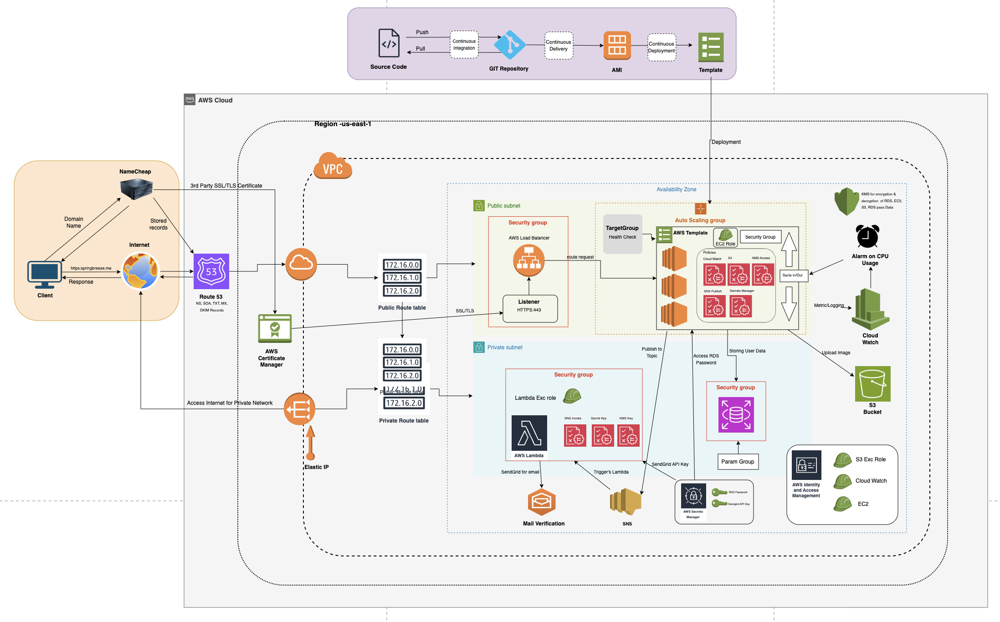

# Cloud-Native-Web-Application
This repository contains a scalable and resilient web application built using cloud-native principles. It leverages microservices architecture, containerization, and CI/CD workflows to deliver high availability and rapid deployment. Ideal for modern, distributed environments with support for cloud providers like AWS.

## Project Overview
This cloud-native application combines a Spring Boot web service with AWS serverless architecture and infrastructure as code using Terraform.

## Project Structure

**Function as a Service**
- `src/` - Source code for Lambda functions
- `terraform-infra/` - Infrastructure code for AWS resources
- `serverless/` - Serverless function configurations

## Components

**Web Application**
- Spring Boot application with CI/CD pipeline
- Automated testing and AMI building
- Template-based deployment system

**Lambda Functions**
- Email verification service
- Token management with 2-minute expiration
- RDS integration for token storage
- SendGrid integration for email delivery

**Infrastructure Components**
- `EC2.tf` - EC2 instance configurations
- `RDS.tf` - Database infrastructure
- `Lambda.tf` - Lambda function definitions
- `SNS.tf` - Simple Notification Service setup
- `CloudWatch.tf` - Monitoring and logging
- `NAT.tf` - Network Address Translation setup
- `VPC.tf` - Virtual Private Cloud configuration
- `LoadBalancer.tf` - Load balancer settings

## Infrastructure as Code
All AWS resources are managed through Terraform:
- Networking (VPC, NAT, Security Groups)
- Compute (EC2, Lambda)
- Database (RDS)
- Security (IAM roles, policies)
- Monitoring (CloudWatch)

## Deployment
The application uses a multi-stage deployment process:
1. CI/CD pipeline for testing
2. AMI creation
3. Infrastructure deployment via Terraform
4. Lambda function deployment

## Security
- Secure key management
- IAM roles and policies
- VPC security groups
- Encrypted data storage

## Getting Started
1. Clone the repository
2. Configure AWS credentials
3. Initialize Terraform: `terraform init`
4. Deploy infrastructure: `terraform apply`
5. Deploy web application
6. Configure Lambda functions

## Prerequisites
- AWS Account
- Terraform installed
- Java/Spring Boot environment
- AWS CLI configured

